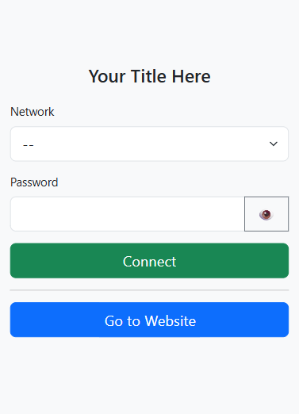
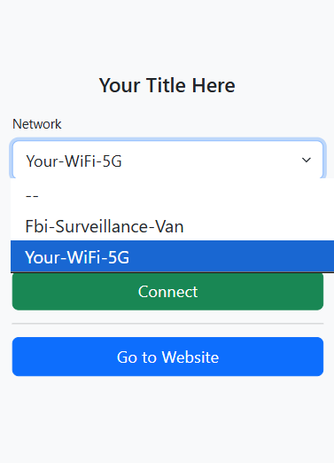
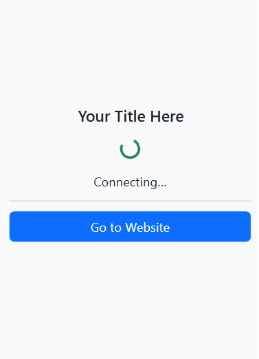
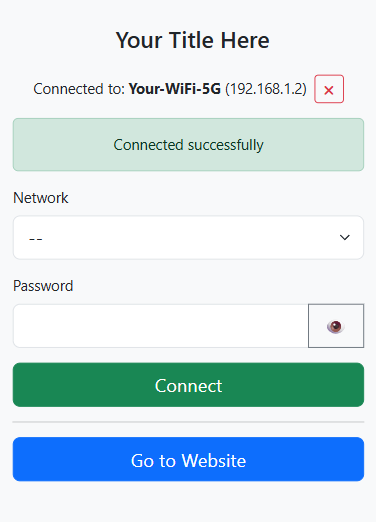
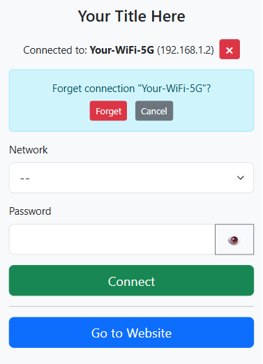

# 🛜 RPi-Hotspot 🛜

  

A simple way to create an AP hotspot on a Raspberry Pi automatically with a captive portal and configure a WiFi connection a web ui interface.
## How it works ❓
**This requires TWO WIRELESS INTERFACES** one to host the AP and one to connect to your WiFi. This is designed to run on boot, and look for internet connection. If the device is not connected to the internet a wireless AP is created and traffic from the AP nic with a destination to port `80` is redirected to port `8080` (this is to prevent conflicts with a webserver if one is running on the device). Once you connect to the AP, it will ask you to sign in and redirect you to the captive page now available at `http://<hostname>.local`. This webpage allows you to select a wifi and connect to it using the other wireless nic on your device. After successful connection the AP is disabled, the rule to forward AP traffic from `8080 -> 80` is removed, and the wifi configuration webpage stays active on `http://<hostname>.local:8080`. If you reboot, and the device has internet, the AP does not get turned on but the wifi configuration webpage is still active in the background on port `8080`

## Features ✨
- Easy setup script for Raspberry Pi and other Debian-based systems
- Customizable captive portal
- Ability to forget the WiFi connection and reactivate the AP.
- Simple start/stop with `sudo systemclt start/stop rpi-hotspot-manager.service`
- "Go to Website" button will redirect you to `http://<hostname>.local` and remove the port `8080 -> 80` rule and allow you to have normal network access to you raspberry pi without internet using the AP.

## Quick Start 🚀
1. Make scripts executable with `chmod +x *.sh`
2. Edit the environment variables in `install.sh` with `nano install.sh`
3. Run `sudo install.sh` to install
4. Reboot `sudo reboot`

## Images 📸
Preview of Rpi-Hotspot web ui:

   

## TO DO 📃
- One wireless nic functionality
- Username/Password to access captive page
- Dark mode 

## Contributing ❤️
Feel free to open issues or PRs. Small enhancements like improving the captive portal UI or adding functionality are welcome.

## License
MIT-style (check project owner for exact terms).

---
Made with ❤️ by Eric Prince in the USA.
